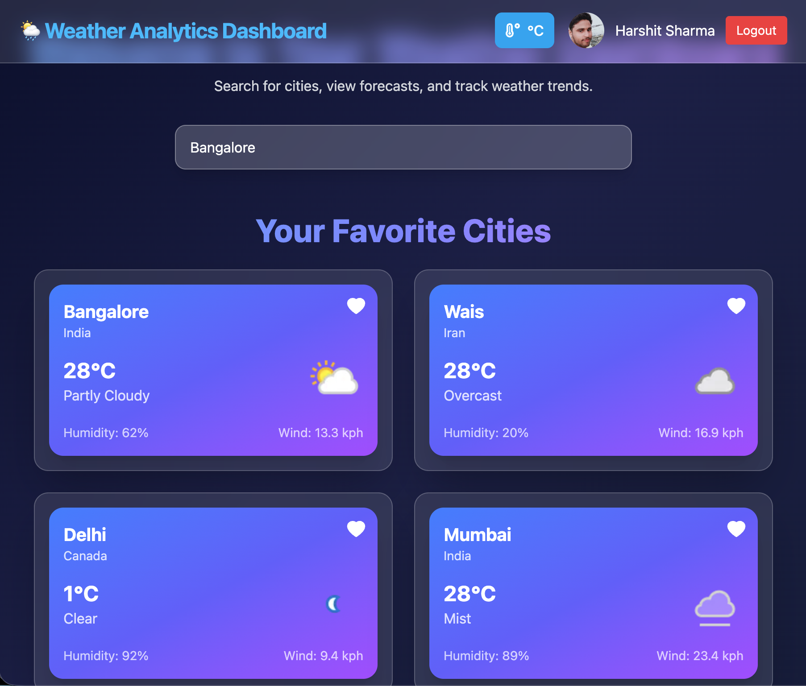
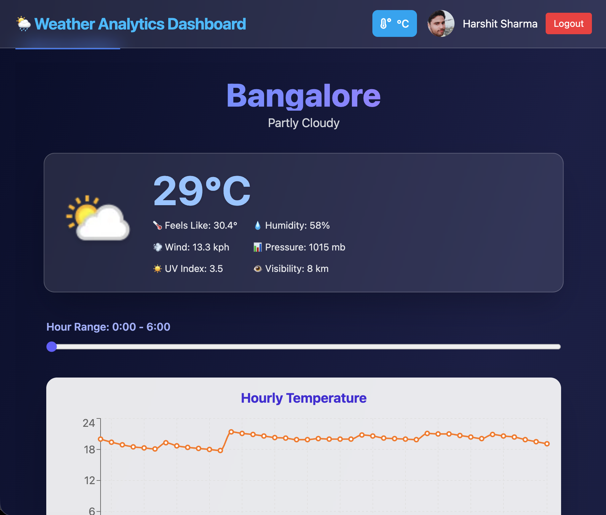
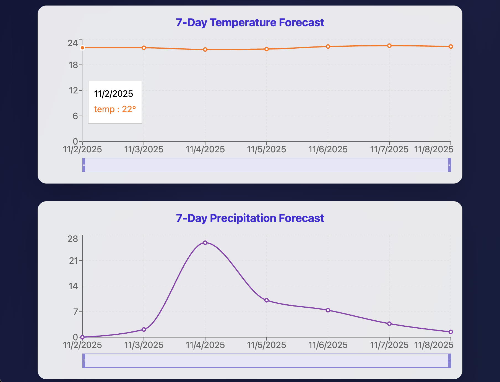
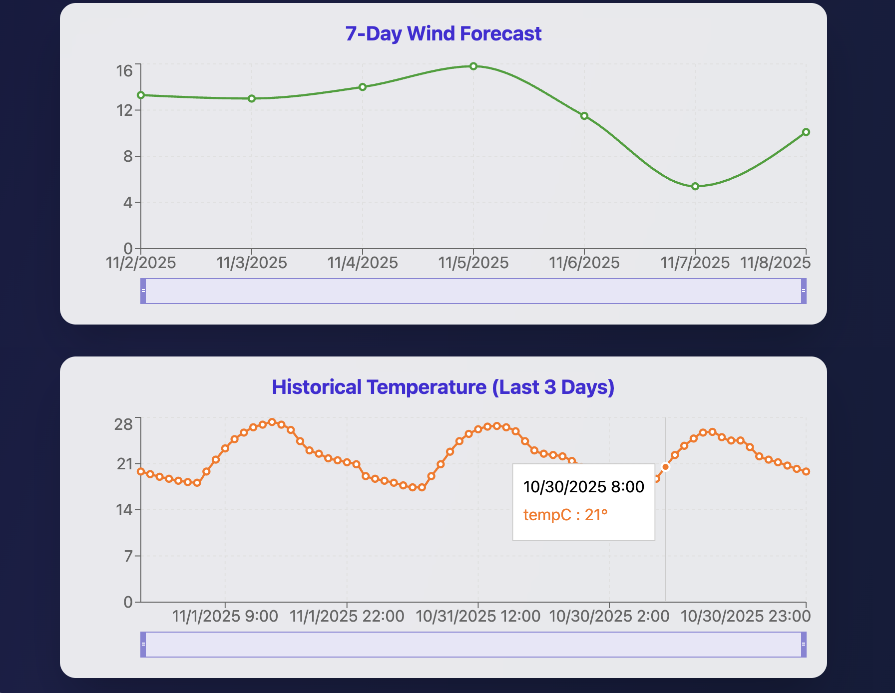

# Weather Analytics Dashboard

A **responsive Weather Analytics Dashboard** built with **React, TypeScript, Vite, Redux Toolkit, Recharts**, and **Firebase Hosting**.  
This app displays current weather, 7-day forecasts, and historical trends with interactive charts.

Live Demo: [https://weather-dashboard-96a44.web.app](https://weather-dashboard-96a44.web.app)

---

## Features

- 🌡 **Current Weather:** Shows temperature, humidity, wind, pressure, UV index, and visibility.
- 📊 **Hourly Temperature:** Interactive charts with temperature and "feels like" data.
- 📅 **7-Day Forecast:** Temperature, precipitation, and wind charts.
- 🕒 **Historical Data:** Last 3 days' temperature trends.
- 🌐 **Responsive Design:** Works on desktop, tablet, and mobile devices.
- ⚡ **Auto Updates:** Fetches weather data every minute.

---

## Technologies Used

- **React + TypeScript** for a type-safe frontend.
- **Vite** for fast development and build process.
- **Redux Toolkit** for state management.
- **Recharts** for interactive and responsive charts.
- **Firebase Hosting** for deployment.
- **Tailwind CSS** for styling.
- **Framer Motion** for smooth animations.
- **Firebase Authentication (Google OAuth)** for user login.

---

## Screenshots

### Dashboard


### City Detail Page


### Hourly Temperature & Feels Like


### 7-Day Temperature & Precipitation Forecast


### Wind Forecast & Historical Temperature



## Getting Started

### Install Dependencies

```bash
git clone https://github.com/sharmaHarshit2000/weather-app-dashboard.git
cd weather-app
npm install
```

## Environment Variables

Create a `.env` file in the root of your project and add:

```
VITE_WEATHER_API_KEY=
VITE_WEATHER_API_BASE=

VITE_FIREBASE_API_KEY=
VITE_FIREBASE_AUTH_DOMAIN=
VITE_FIREBASE_PROJECT_ID=
VITE_FIREBASE_STORAGE_BUCKET=
VITE_FIREBASE_MESSAGING_SENDER_ID=
VITE_FIREBASE_APP_ID=
```

---

### Run Locally

```bash
npm run dev
```

Open http://localhost:5173 to view the app.

---

## Project Structure

```
weather-app/
├── public/                 # Static assets
├── src/
│   ├── api/                # API calls (weatherApi)
│   ├── app/                # Redux store
│   ├── components/         # Reusable components
│   ├── features/           # Redux slices
│   ├── hooks/              # Custom hooks
│   ├── pages/              # Page components (CityDetail, Home, etc.)
│   ├── utils/              # Helper functions
│   ├── App.tsx
│   └── main.tsx
├── dist/                   # Production build
├── firebase.json           # Firebase configuration
├── package.json
└── README.md
```

---

## Available Scripts

- `npm run dev` – Run the app locally.
- `npm run build` – Build the app for production.
- `npm run preview` – Preview production build locally.

---

## Contributing

1. Fork the repository.
2. Create a new branch: `git checkout -b feature/your-feature`.
3. Make changes and commit: `git commit -m "Add your feature"`.
4. Push to your branch: `git push origin feature/your-feature`.
5. Create a Pull Request.

---

## License

This project is licensed under the MIT License.

---

## Acknowledgements

- [Vite](https://vitejs.dev/)
- [React](https://reactjs.org/)
- [Redux Toolkit](https://redux-toolkit.js.org/)
- [Recharts](https://recharts.org/)
- [Firebase](https://firebase.google.com/)
- [Tailwind CSS](https://tailwindcss.com/)
- [Framer Motion](https://www.framer.com/motion/)
